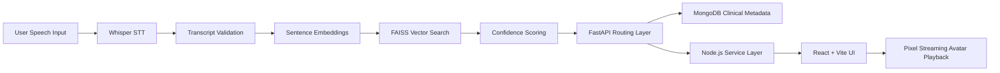
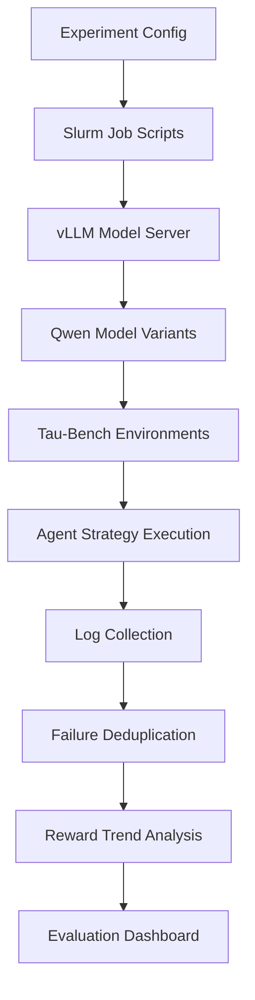

<div align="center">

# 👋 Hey, I'm Aarya Bhutkar


<br/>

[](https://www.linkedin.com/in/aarya-bhutkar07/)
[](https://github.com/AaryaBhutkar)
[](mailto:aaryabhutkar3@gmail.com)

</div>

---

## 🧠 About Me

```yaml
name: Aarya Bhutkar
role: AI Software Engineer | Full-Stack Developer | GenAI Systems Builder
location: Tempe, Arizona
education:
  - MS Computer Science, Arizona State University
  - BE Information Technology with Honors in AI/ML
current_focus:
  - Generative AI Systems
  - Retrieval-Augmented Generation
  - Agentic AI Workflows
  - LLM Evaluation
  - Full-Stack AI Applications
  - Cloud-Native Software Engineering
```

I am a **Computer Science graduate student at Arizona State University** and an **AI Software Engineer** passionate about building intelligent, scalable, and production-ready software systems.

My work sits at the intersection of:

- 🤖 **Generative AI**
- 🧠 **LLM Evaluation**
- 🔎 **Vector Search & RAG**
- 🎙️ **Speech-to-Text AI**
- ⚙️ **Backend Systems**
- 🌐 **Full-Stack Web Applications**
- ☁️ **Cloud & DevOps**

Currently, I am working on an AI-enabled **Virtual Insomnia Patient Clinical Simulation Platform**, where I build features involving **React, Vite, Node.js, FastAPI, MongoDB, FAISS, Whisper STT, NLP pipelines, and Pixel Streaming**.

---

## ⚡ Tech Arsenal

<div align="center">

### Languages


### AI / ML / GenAI


### Full Stack


### Databases, Cloud & DevOps


</div>

---

## 🧬 System Design Mindset

```txt
User Input
   ↓
Speech / Text Processing
   ↓
Transcript Validation
   ↓
Embedding Generation
   ↓
Vector Retrieval with FAISS
   ↓
Confidence Scoring
   ↓
NLP Fallback Handling
   ↓
Backend API Routing
   ↓
Frontend Simulation Response
   ↓
User Feedback + Evaluation Loop
```

I like designing systems where **AI is not just a model call**, but part of a complete engineering pipeline involving:

- clean APIs
- measurable evaluation
- fallback handling
- metadata tracking
- retrieval quality
- user-facing reliability
- scalable deployment patterns

---

## 💼 Experience

<table>
<tr>
<td width="50%">

### 🏥 AI Software Engineer  
**Arizona State University**  
`Apr 2026 – Present`

Built AI-enabled clinical training features for a **Virtual Insomnia Patient platform** supported by Department of Defense funding.

**Core Work:**

- Integrated **React, Vite, Node.js, FastAPI, MongoDB, FAISS, Whisper STT, and Pixel Streaming**
- Improved speech-to-response routing using embeddings and vector retrieval
- Built confidence scoring, transcript validation, and NLP fallback systems
- Developed clinical simulation workflows across 12+ modules
- Supported synchronized avatar playback and diagnostic metadata tracking

</td>
<td width="50%">

### 🌐 Full Stack Software Development Intern  
**BITROOT**  
`Jun 2024 – Aug 2024`

Designed scalable and responsive web applications using cloud and full-stack technologies.

**Core Work:**

- Built applications using **AWS, React.js, Node.js, and MySQL**
- Improved load times through API tuning and query optimization
- Developed mobile-responsive interfaces
- Resolved 30+ bugs through debugging and reviews
- Reduced post-deployment issues through systematic testing

</td>
</tr>
</table>

<table>
<tr>
<td width="100%">

### 🤖 AI Trainer  
**Outlier**  
`Jan 2024 – Mar 2024`

Worked on improving LLM behavior through prompt creation, response evaluation, and annotation.

**Core Work:**

- Created and refined **500+ prompts**
- Reviewed and annotated **1,000+ model outputs**
- Improved training data coverage across healthcare, finance, education, and more
- Applied human-centered prompting techniques to improve response relevance and fluency

</td>
</tr>
</table>

---

## 🚀 Featured Technical Projects

---

### 🧑‍⚕️ Virtual Insomnia Patient Clinical Simulation Platform

> AI-powered browser-based therapy simulation system for clinical training workflows.



**Tech Stack**

`React` `Vite` `Node.js` `FastAPI` `MongoDB` `FAISS` `Whisper STT` `NLP` `Pixel Streaming`

**Technical Highlights**

- Built browser-based therapy workflows with speech-to-response routing
- Integrated Whisper STT for transcript generation
- Used FAISS vector retrieval for response matching
- Added confidence scoring and fallback handling
- Improved dialogue relevance through GenAI reasoning and NLP pipelines
- Built AI testing interfaces and response review screens
- Supported routing logic across 12+ clinical modules

---

### 📊 Agentic AI Benchmarking & Evaluation Platform

> Reproducible benchmarking system for evaluating AI agents across task-based environments.



**Tech Stack**

`Python` `vLLM` `Slurm` `Tau-Bench` `Qwen Models` `Pandas` `Matplotlib`

**Technical Highlights**

- Architected a reproducible evaluation system for agentic AI experiments
- Decoupled model servers, Slurm scripts, and experiment drivers
- Automated sweeps across airline and retail benchmark environments
- Evaluated multiple Qwen model sizes across agent strategies
- Built Python utilities for log cleaning, failed-trial deduplication, and reward tracking
- Reduced debugging and restart time through modular experiment design

---

## 🧪 Areas I Like Building In

```python
interests = {
    "generative_ai": [
        "RAG pipelines",
        "LLM evaluation",
        "agentic workflows",
        "prompt engineering",
        "retrieval optimization"
    ],
    "software_engineering": [
        "backend APIs",
        "distributed services",
        "database optimization",
        "cloud deployment",
        "CI/CD automation"
    ],
    "full_stack": [
        "React dashboards",
        "AI testing interfaces",
        "simulation controls",
        "developer tools",
        "responsive applications"
    ]
}
```

---

## 🎓 Education

<table>
<tr>
<td width="50%">

### 🎓 Arizona State University  
**Master of Science in Computer Science**  
`Aug 2025 – May 2027`

**GPA:** `4.00 / 4.00`

Focus Areas:

- Artificial Intelligence
- Software Engineering
- Systems
- Full-Stack Development
- LLM Applications

</td>
<td width="50%">

### 🎓 Vidyalankar Institute of Technology  
**B.E. Information Technology**  
**Honors in AI/ML**  
`Aug 2021 – May 2025`

**GPA:** `3.88 / 4.00`

Focus Areas:

- Machine Learning
- Data Structures
- Web Development
- Database Systems
- Cloud Computing

</td>
</tr>
</table>

---

## 🏆 Highlights

```txt
✔ AI Software Engineer working on clinical simulation technology
✔ Experience with GenAI, RAG, FAISS, Whisper STT, and NLP pipelines
✔ Full-stack development experience with React, Node.js, FastAPI, MongoDB, and MySQL
✔ Built agentic AI benchmarking workflows using vLLM, Slurm, Tau-Bench, and Qwen models
✔ Graduate GPA: 4.00 / 4.00 at Arizona State University
✔ Undergraduate GPA: 3.88 / 4.00 with Honors in AI/ML
```

---

## 📊 GitHub Analytics

<div align="center">


<br/>


<br/>


</div>

---

## 🧩 Current Technical Focus

<div align="center">

| Area | What I'm Exploring |
|---|---|
| 🧠 Generative AI | RAG, LLM evaluation, agent workflows |
| 🔎 Retrieval Systems | FAISS, embeddings, semantic search |
| 🎙️ Speech AI | Whisper STT, transcript validation |
| ⚙️ Backend Engineering | FastAPI, Node.js, scalable APIs |
| 🌐 Frontend Engineering | React, Vite, AI testing interfaces |
| ☁️ Cloud Systems | AWS, Azure, Docker, Kubernetes |
| 📊 Evaluation | Benchmarks, logs, failure analysis, reward trends |

</div>

---

## 🐍 Contribution Graph

<div align="center">


</div>

---

## 🌐 Connect With Me

<div align="center">

I'm always open to discussing:

**AI Engineering · Full-Stack Development · LLM Systems · RAG · Agentic AI · Software Engineering Internships · Research Collaboration**

<br/>

[](https://www.linkedin.com/in/aarya-bhutkar07/)
[](https://github.com/AaryaBhutkar)
[](mailto:aaryabhutkar3@gmail.com)

</div>

---

<div align="center">

### ⚡ Building AI systems that move from prototypes to real-world impact.


</div>
